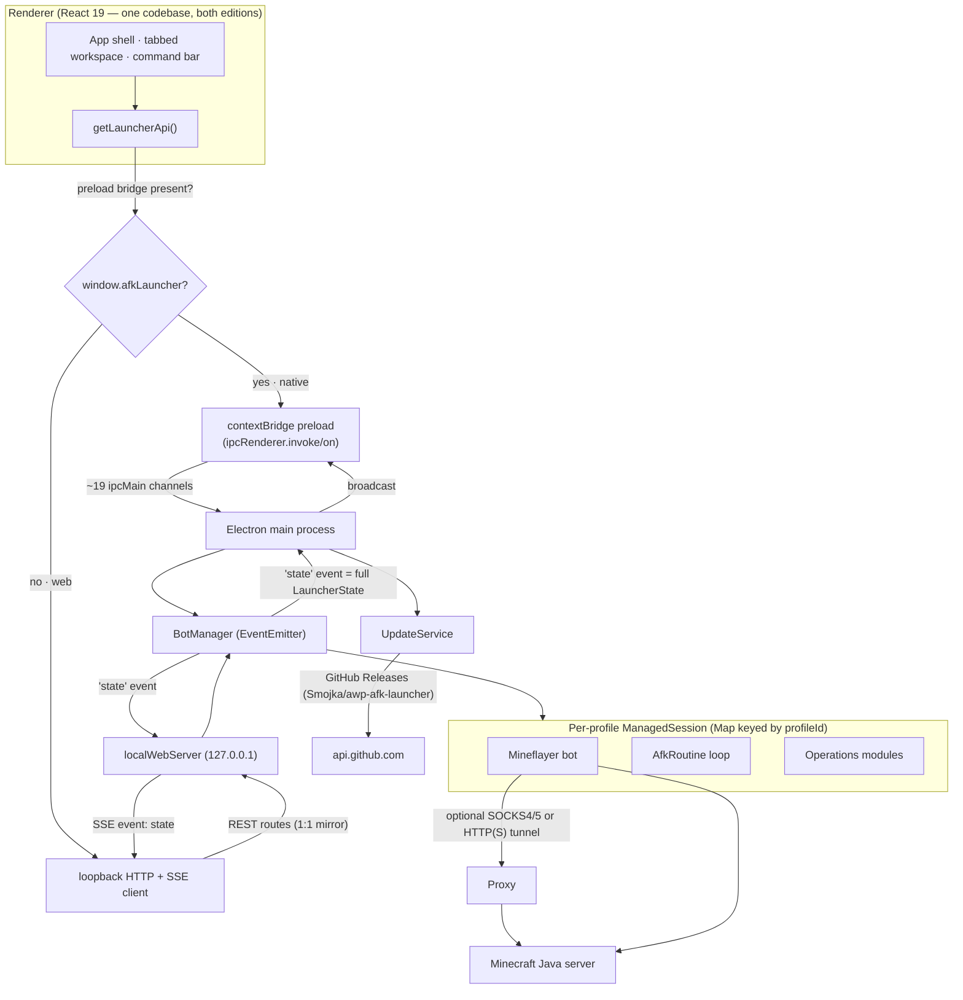

<div align="center">

# ChunkKeeper

**A desktop & local‑web command desk for authorized Minecraft Java AFK sessions.**

Manage many accounts, keep sessions alive, run lobby‑auth/transfer flows, drive farm & script automation, and watch live telemetry — from one dense operator UI.

[](LICENSE)
[](package.json)
[](#platform-support-matrix)
[](https://www.electronjs.org/)
[](https://react.dev/)
[](https://github.com/PrismarineJS/mineflayer)

*Developed by **smojka**.*

</div>

---

> [!IMPORTANT]
> **Authorized use only.** ChunkKeeper is a narrow tool for accounts **you own**, on servers where **AFK automation is explicitly allowed**. It is deliberately **not** a modpack launcher, hacked/combat client, account marketplace, or full Minecraft client. Automating accounts you do not own, or on servers that forbid AFK bots, violates most server rules and Minecraft's EULA. You are responsible for how you use it.

---

## Table of contents

- [What ChunkKeeper is (and isn't)](#what-chunkkeeper-is-and-isnt)
- [Feature highlights](#feature-highlights)
- [Two editions: Native vs Web](#two-editions-native-vs-web)
- [Architecture](#architecture)
- [Names you'll see (product vs package vs repo)](#names-youll-see-product-vs-package-vs-repo)
- [Download & install (end users)](#download--install-end-users)
  - [macOS first launch (Gatekeeper)](#macos-first-launch-gatekeeper)
  - [Windows](#windows)
- [Getting started (developers)](#getting-started-developers)
- [Project structure](#project-structure)
- [Using the app](#using-the-app)
- [Data model & profiles](#data-model--profiles)
- [Configuration reference](#configuration-reference)
  - [Account profile](#account-profile)
  - [Join / lobby‑auth flow](#join--lobby-auth-flow)
  - [AFK routine](#afk-routine)
  - [Reconnect policy](#reconnect-policy)
  - [Proxy](#proxy)
  - [App settings](#app-settings)
- [Operations modules](#operations-modules)
- [Live telemetry & inventory](#live-telemetry--inventory)
- [In‑app auto‑update](#in-app-auto-update)
- [Security & credential model](#security--credential-model)
- [Environment variables](#environment-variables)
- [Testing](#testing)
- [Building & packaging](#building--packaging)
- [Releasing (GitHub Actions)](#releasing-github-actions)
- [Platform support matrix](#platform-support-matrix)
- [Supported Minecraft versions](#supported-minecraft-versions)
- [Known limitations & gotchas](#known-limitations--gotchas)
- [Troubleshooting](#troubleshooting)
- [Localization](#localization)
- [Tech stack](#tech-stack)
- [Contributing](#contributing)
- [License](#license)

---

## What ChunkKeeper is (and isn't)

ChunkKeeper is a focused **operator console** for running one or more Minecraft Java bots that stay online and productive while you are away from the keyboard. Each account is a *profile*; each profile drives one [Mineflayer](https://github.com/PrismarineJS/mineflayer) bot in the Electron main process. The renderer never fabricates bot state — what you see is the real runtime, or an explicit error when the backend is unreachable.

**It is:**

- A multi‑account session manager with independent start/stop per bot and bulk start/stop.
- A lobby login/register → server‑transfer → post‑transfer flow runner.
- An AFK‑preservation engine (randomized look/jump/sneak/swing, chat heartbeat, auto‑eat, auto‑respawn, reconnect backoff).
- A light automation suite (cactus farm, crop farm, 3D area mine/fill, generator loop, command scripts, chat auto‑response, Discord bridge).
- A live telemetry & inventory dashboard.

**It is not:** a modpack launcher, a hacked/combat client, an account marketplace, a full 3D Minecraft client, or a credential vault. Sensitive values (lobby passwords, proxy passwords, Discord webhooks/tokens) are handled **at runtime only** and never written to disk. See [Security & credential model](#security--credential-model).

---

## Feature highlights

| Area | What you get |
| --- | --- |
| **Accounts** | Unlimited per‑profile bots · offline or Microsoft auth · per‑bot server/version/proxy · Start all / Stop all with configurable stagger |
| **Join flow** | Gated on `spawn` so AFK actions never fire in the auth lobby · Login / Register / Custom / None · `{password}` substituted at runtime only · delayed `/smp`‑style transfer · ordered post‑transfer flow commands |
| **AFK routine** | One randomized action per jittered tick: random look, jump pulse, sneak pulse, swing pulse, chat heartbeat · auto‑eat with safe‑food guard · auto‑respawn · exponential‑backoff reconnect |
| **Automation** | Cactus farm · crop farm (7 crop types) · 3D area mine/fill · generator loop · looping command scripts · chat auto‑response rules · Discord webhook + remote‑command bridge |
| **Unattended runs** | Shared **chest storage** — deposit harvest / restock seeds & fill‑blocks with a keep‑list (never dumps tools, buckets, food, or your active seed) · **auto‑resume** of running farms after an involuntary reconnect, behind a world‑validation gate · retry‑then‑safe‑pause on a full/missing chest (never drops items) · "capture chest from bot" button |
| **Telemetry** | Health, hunger, ping, X/Y/Z, dimension, players online, inventory usage · live inventory grid with item textures · chat console · pulse/event timeline · live harvest‑progress bar |
| **UX** | Tabbed workspace · persistent command bar with tab‑completion & quick‑commands · structured row editors · on‑screen `?` help on nearly every control · compact density · reduced‑motion & keyboard focus support |
| **Ops** | In‑app auto‑update (silent on Windows, notify‑and‑download on macOS) · local browser‑dashboard build · Docker smoke server · live end‑to‑end test harness |

---

## Two editions: Native vs Web

The same React renderer ships in **two Electron builds** that behave very differently at the process level:

| | **ChunkKeeper** (native) | **ChunkKeeper Web** (dashboard) |
| --- | --- | --- |
| Entry (`main`) | `dist-electron/electron/main.js` | `dist-electron/electron/web-main.js` |
| App ID | `com.smojka.chunkkeeper` | `com.smojka.chunkkeeper.web` |
| UI surface | Electron `BrowserWindow` + `contextBridge` preload IPC | Headless — serves the renderer over **loopback HTTP** and opens your default browser |
| Renderer ↔ backend | IPC (`window.afkLauncher`) | `fetch` + `EventSource` against `http://127.0.0.1:3000` (auto‑increments if busy) |
| Live updates | `launcher:state` IPC push | Server‑Sent Events (`GET /api/events`, `event: state`) |
| Auto‑update | ✅ Yes | ❌ No (publishing disabled by design) |
| Window controls | Custom (Win/Linux) / native (macOS) | N/A (runs in a normal browser) |

> [!WARNING]
> **Both editions share the same on‑disk user‑data directory** (profiles, Microsoft auth cache). **Run only one at a time** — concurrent access to the same profile/auth state can corrupt it.

The web edition binds to `127.0.0.1` only and enforces a two‑layer `Host` + `Origin` loopback gate; it is **not** meant to be exposed to a network.

---

## Architecture



**Load‑bearing ideas:**

1. **One renderer, two backends.** `getLauncherApi()` returns the Electron preload bridge when present, otherwise a loopback HTTP+SSE client. If neither is reachable it shows an explicit error and renders **no fake data** (`demoState.ts` is for previews/tests only).
2. **The web REST API is a deliberate 1:1 mirror of the IPC channels**, so the identical renderer works unchanged in both editions.
3. **`BotManager`'s single `state` event is the only telemetry channel.** It carries the entire `LauncherState` (profiles, per‑session snapshots, runtime, settings). Native broadcasts it to all windows; web serializes it to an SSE frame. There is no per‑field granularity.
4. **`BotManager` owns a `Map` of `ManagedSession`s**, one per profile, each wrapping a Mineflayer bot with optional proxy tunnel, the timed join flow, the AFK routine, and the operation modules.

### IPC channel ↔ REST route ↔ BotManager method

| Preload / IPC | Web REST route | BotManager method |
| --- | --- | --- |
| `launcher:getState` | `GET /api/state` | `getState()` |
| `profile:save` | `POST /api/profiles` | `saveProfile()` |
| `profile:delete` | `DELETE /api/profiles/:id` | `deleteProfile()` |
| `profile:select` | `POST /api/profiles/:id/select` | `selectProfile()` |
| `bot:connect` | `POST /api/bots/:id/connect` | `connect()` |
| `bot:disconnect` | `POST /api/bots/:id/disconnect` | `disconnect()` |
| `bot:startAll` | `POST /api/bots/start-all` | `startAll()` |
| `bot:stopAll` | `POST /api/bots/stop-all` | `stopAll()` |
| `bot:sendChat` | `POST /api/bots/:id/chat` | `sendChat()` |
| `bot:runQuickScript` | `POST /api/bots/:id/quick-script` | `runQuickScript()` |
| `bot:completeChat` | `POST /api/bots/:id/complete` | `completeChat()` |
| `bot:inventoryAction` | `POST /api/bots/:id/inventory` | `inventoryAction()` |
| `bot:startOperation` | `POST /api/bots/:id/operations` | `startOperation()` |
| `bot:stopOperation` | `DELETE /api/bots/:id/operations/:kind` | `stopOperation()` |
| `bot:configureDiscord` | `POST /api/bots/:id/discord` | `configureDiscord()` |
| `app:updateSettings` | `PATCH /api/settings` | `updateSettings()` |
| `app:openUserData` | `POST /api/open-user-data` | *(opens user‑data dir)* |
| `launcher:state` (push) | `GET /api/events` (SSE) | `'state'` event |
| `update:*`, `window:*` | *(native only — web returns no‑ops)* | `UpdateService` / window controls |

---

## Names you'll see (product vs package vs repo)

Three names coexist. This is intentional (historical), so it's called out to avoid confusion:

- **Product / brand:** **ChunkKeeper** — the window title, app name, artifact prefix, and app IDs (`com.smojka.chunkkeeper`).
- **npm package:** `afk-launcher` — the `name` in `package.json`.
- **GitHub repo / update channel:** [`Smojka/awp-afk-launcher`](https://github.com/Smojka/awp-afk-launcher) — where releases are published and where the in‑app updater checks for new versions.

---

## Download & install (end users)

Grab the installer for your platform from the [**Releases**](https://github.com/Smojka/awp-afk-launcher/releases) page. Artifacts follow this naming (with the real version and arch substituted):

| File | Edition | Platform |
| --- | --- | --- |
| `ChunkKeeper-<version>-arm64.dmg` | Native | macOS (Apple Silicon) |
| `ChunkKeeper-Setup-<version>-x64.exe` | Native | Windows (installer) |
| `ChunkKeeper-Web-<version>-arm64.dmg` | Web dashboard | macOS (Apple Silicon) |
| `ChunkKeeper-Web-Portable-<version>-x64.exe` | Web dashboard | Windows (portable, no installer) |
| `ChunkKeeper-macOS-First-Run.zip` | Gatekeeper helper | macOS |

> [!NOTE]
> The automated release currently ships **Apple Silicon (arm64)** macOS builds and **x64** Windows builds only. See [Platform support matrix](#platform-support-matrix).

### macOS first launch (Gatekeeper)

ChunkKeeper is **ad‑hoc signed but not notarized** — notarization requires a paid ($99/yr) Apple Developer ID this project doesn't use. So the **first** time you open a downloaded build, macOS shows:

> **"ChunkKeeper" Not Opened** — Apple could not verify "ChunkKeeper" is free of malware…

This is the standard one‑time prompt for every free, unsigned Mac app — not a real malware finding. In that dialog click **`Done`**, never **`Move to Trash`**, then use one method below (once per install).

**Method 1 — System Settings (no Terminal):**

1. Open the DMG and drag **ChunkKeeper** into **Applications**.
2. Double‑click ChunkKeeper, then click **Done** on the warning.
3. Open **System Settings → Privacy & Security**, scroll to **Security**.
4. Next to *"ChunkKeeper was blocked…"* click **Open Anyway** and confirm with your password.
   - The button only appears for ~1 hour after step 2; if it's gone, double‑click the app again to bring it back.
5. ChunkKeeper opens and macOS remembers the choice.

**Method 2 — one Terminal command (most reliable):**

```bash
xattr -dr com.apple.quarantine "/Applications/ChunkKeeper.app"
```

Use `"/Applications/ChunkKeeper Web.app"` for the web build. This removes the "downloaded from the internet" quarantine flag so the app launches with no prompt.

The release also ships **`ChunkKeeper-macOS-First-Run.zip`**, which automates Method 2 for apps named `ChunkKeeper.app` / `ChunkKeeper Web.app` in `/Applications` or `~/Applications`. Because the helper is itself downloaded, run it through Terminal:

```bash
bash ~/Downloads/ChunkKeeper-macOS-First-Run.command
```

### Windows

Run `ChunkKeeper-Setup-<version>-x64.exe`. The installer lets you choose the install directory and creates a desktop shortcut. SmartScreen may show a reputation warning for new, unsigned releases — download only from the official Releases page. The **Web** edition is a single portable `.exe` (no install).

---

## Getting started (developers)

### Prerequisites

- **Node.js 22+** and **npm** (CI builds on Node 22).
- **macOS** to build macOS DMGs; **Windows** (or a CI runner) for the Windows installer.
- **Docker** only if you want the local Minecraft smoke server.

### Install & run

```bash
npm install

# Native desktop app (Electron BrowserWindow + preload bridge)
npm run dev

# Local browser‑dashboard app (headless Electron + loopback web server)
npm run dev:web
```

`npm run dev` starts Vite on `127.0.0.1:5173` and launches the native Electron window. `npm run dev:web` starts the same renderer but serves it over `http://127.0.0.1:3000` (it scans forward up to 12 ports if 3000 is taken) and opens your default browser.

> The raw Vite page on its own is **not** the app — with no Electron preload bridge and no local web server, the renderer shows an explicit "bridge unavailable" error rather than fake data. Always run through `npm run dev` / `dev:web` or a packaged build.

### Everyday commands

```bash
npm run typecheck   # tsc --noEmit for both the renderer and electron tsconfigs
npm test            # Vitest unit suite (run once)
npm run test:watch  # Vitest in watch mode
npm run build       # typecheck → vite build → tsc electron
npm audit --omit=dev
```

See [Testing](#testing), [Building & packaging](#building--packaging), and [Environment variables](#environment-variables) for more.

---

## Project structure

```text
electron/                Electron entry points
  main.ts                Native main process: window, tray, IPC, boot BotManager + UpdateService
  web-main.ts            Headless web build: boots BotManager + local web server, opens browser
  preload.ts             contextBridge — exposes the typed `afkLauncher` API to the renderer
  paths.ts               Resolves the shared user‑data directory

src/main/
  bot/
    botManager.ts        Core: sessions, connect/join flow, reconnect, telemetry, all operations
    afkRoutine.ts        AFK preservation loop (look/jump/sneak/swing/chat)
    defaultProfiles.ts   Shipped default profile(s)
  server/localWebServer.ts   Loopback HTTP + SSE server (web edition)
  storage/profileStore.ts    profiles.json persistence + secret stripping
  update/updateService.ts    In‑app auto‑update via GitHub Releases

src/renderer/            React UI (App.tsx, api.ts, itemIcon.ts, demoState.ts, styles.css)
src/shared/              types.ts (data model) + heartbeatMessages.ts (default chat pool)

scripts/                 Packaging prune hook, icon generation, smoke & live tests, mac first‑run helper
build/                   App icons (.icns / .ico / .png)
docs/                    Research & iteration notes
.github/workflows/       release.yml — tag‑triggered GitHub Release pipeline
```

---

## Using the app

1. **Start ChunkKeeper** (native) or **ChunkKeeper Web** and open the dashboard URL it prints.
2. **Pick or create a profile** in the left sidebar. *New account* clones safe fields from the current profile (password left blank).
3. **Fill in the profile** (Overview tab → *Edit* / the profile editor modal):
   - **Label** — local display name.
   - **Username** — Minecraft username (the shipped default profile has an empty username you must fill in).
   - **Host / Port** — target server (port defaults to `25565`).
   - **Version** — protocol version, or *Auto* to let the client negotiate.
   - **Auth mode** — `offline` (authorized offline/cracked servers) or `microsoft` (real Java account; the device‑code login session is cached on disk — no password is stored).
4. **Configure the Join flow** if the server starts in a lobby (see [Join / lobby‑auth flow](#join--lobby-auth-flow)).
5. **Tune the AFK routine** (Routine tab).
6. **Save**, then press **Connect**.

The workspace has five tabs: **Overview** (KPIs, coordinates, connection), **Operations** (automation modules), **Inventory** (live grid with item textures + slot actions), **Routine** (AFK toggles/sliders), **Activity** (chat console + pulse/event timeline). A persistent **command bar** sits above the tabs with tab‑completion, Enter‑to‑send, and a searchable quick‑command menu. Nearly every control has a focusable **`?`** help icon.

---

## Data model & profiles

Everything is persisted to a **single `profiles.json`** file under the Electron user‑data directory (`stripProfileSecrets` runs on **both** save and load, so secrets never touch disk). The document shape is:

```jsonc
{
  "selectedProfileId": "session-01",
  "profiles": [ /* AccountProfile[] */ ],
  "settings": { /* AppSettings */ }
}
```

An `AccountProfile` bundles: identity (`id`, `label`, `username`), connection (`host`, `port`, `version`, `authMode`, `enabled`), and nested config objects — `startup` (join flow), `routine` (AFK), `reconnect`, optional `proxy`, optional `modules` (the seven operations), and optional `storage` (shared chest deposit/restock config).

**One default profile ships:** `ARKONAS_SMP` → `play.arkonas.net:25565`, version `1.20.1`, `offline` auth, join flow enabled, **empty username** (fill it in before connecting).

---

## Configuration reference

Values are clamped/normalized on save. Defaults below are the shipped/`DEFAULT_SETTINGS` values.

### Account profile

| Field | Meaning | Default |
| --- | --- | --- |
| `label` | Local display name | — |
| `username` | Minecraft username | *(empty in shipped profile)* |
| `host` / `port` | Target server | port `25565` |
| `version` | Protocol version; `false` = auto‑detect | `false` (auto) |
| `authMode` | `offline` or `microsoft` | `offline` |
| `enabled` | Included in **Start all** | `true` |

### Join / lobby‑auth flow

Auth commands are sent **only after Mineflayer emits `spawn`**, so AFK actions never start while still in the auth lobby. The join sequence runs on cumulative timers: *auth command* → *transfer command* → *ordered flow commands* → routine starts ~500 ms later.

| Field | Meaning | Default |
| --- | --- | --- |
| `enabled` | Run the join sequence at all | `false` (`true` in shipped profile) |
| `authMode` | `none` · `login` · `register` · `custom` | `login` |
| `authCommandTemplate` | Login/custom command; supports `{password}` | `/login {password}` |
| `registerCommandTemplate` | Register command; supports `{password}` | `/register {password} {password}` |
| `authPassword` | **Runtime‑only secret** substituted into `{password}` | *(never persisted)* |
| `authDelayMs` | Delay after spawn before the auth command | `2500` |
| `transferCommand` | Server‑transfer command (e.g. move to SMP) | `/smp` |
| `transferDelayMs` | Delay before the transfer command | `3500` |
| `flowCommands[]` | Ordered post‑transfer commands, each with its own `delayMs` | `[]` |

The `{password}` placeholder is substituted at runtime only; if a template needs `{password}` but the password is empty, the command is suppressed. Auth commands are redacted in logs.

### AFK routine

The routine fires **one randomly‑chosen enabled action per jittered tick** (not all actions every tick). Timing is clamped: base interval floored at `3000 ms`, jitter `0–80 %`, final delay floored at `1500 ms`.

| Field | Meaning | Default (shipped) |
| --- | --- | --- |
| `randomLook` | Rotate the camera to a random angle | `true` |
| `autoJump` | Short jump pulse (~240 ms) | `true` |
| `sneakPulse` | Short sneak pulse (~420 ms) | `false` |
| `swingArm` | Swing the right arm | `true` |
| `chatHeartbeat` | Send one message from the chat pool (needs ≥1 message) | `false` |
| `chatMessages[]` | Chat pool; never repeats the last line when ≥2 exist | 28 default Turkish casual lines |
| `autoEat` | Eat safe food before hunger gets critical | `true` |
| `eatAtFood` | Start eating at/below this food level (1–19) | `14` |
| `pauseAtFood` | Pause AFK actions at/below this level if no safe food (≤ `eatAtFood`) | `6` |
| `autoRespawn` | Respawn ~3 s after death | `true` |
| `intervalMs` | Base tick interval (min `3000`) | `18000` |
| `jitterPercent` | ± spread on the interval (0–80) | `35` |

> [!NOTE]
> **Where the logic lives:** `afkRoutine.ts` implements look/jump/sneak/swing/chat. **Auto‑respawn and reconnect live in `botManager.ts`**; auto‑eat's food‑safety logic is handled in the bot layer as well. The routine config carries the toggles, but those three behaviors are driven outside the routine loop itself.

### Reconnect policy

Exponential backoff: `delay = min(maxDelayMs, baseDelayMs × 2^(attempt−1))`. Manual **Disconnect** and **Stop all** are treated as intentional stops (no reconnect). A **kick** doesn't reconnect by itself — the following disconnect does.

| Field | Meaning | Default (`defaultReconnect`) |
| --- | --- | --- |
| `enabled` | Retry unexpected disconnects | `true` |
| `maxAttempts` | Stop after this many retries | `8` |
| `baseDelayMs` | First retry delay (≥1000) | `5000` |
| `maxDelayMs` | Backoff ceiling (≥1000) | `90000` |

> [!WARNING]
> **Known quirk:** newly‑created accounts inherit `maxAttempts = 8` from the app‑level default, but a profile constructed **without** an explicit `reconnect` block normalizes `maxAttempts` to `0` — which disables reconnect even though `enabled` is `true`. Set `maxAttempts` explicitly on imported/hand‑edited profiles. See [Known limitations](#known-limitations--gotchas).

### Proxy

Optional per‑bot tunnel. SOCKS via the `socks` package; HTTP/HTTPS via a hand‑rolled `CONNECT` tunnel (accepts a 2xx response). The proxy **password is runtime‑only** and stripped before persistence.

| Field | Meaning | Default |
| --- | --- | --- |
| `enabled` | Use the tunnel | `false` |
| `type` | `socks5` · `socks4` · `http` · `https` | `socks5` |
| `host` / `port` | Proxy endpoint | port clamped 0–65535 |
| `username` / `password` | Optional auth (**password not persisted**) | — |

### App settings

Stored once, app‑wide (Settings modal).

| Setting | Meaning | Default |
| --- | --- | --- |
| `autoStartOnLaunch` | Connect all enabled accounts on launch | `false` |
| `connectStaggerMs` | Delay between successive connects in bulk start | `1500` |
| `confirmStopAll` | Confirm before **Stop all** | `true` |
| `showChatTimestamps` | Time column in the chat console | `true` |
| `compactDensity` | Denser, tighter layout | `false` |
| `minimizeToTrayOnClose` | Close → tray instead of quit (Win/Linux) | `true` |
| `defaultReconnect` | Reconnect policy pre‑filled into **new** accounts | `{ enabled, maxAttempts: 8, baseDelayMs: 5000, maxDelayMs: 90000 }` |

The Electron window is preferred at **1280×760** and clamps to a **760×540** minimum; below certain widths the layout switches to stacked responsive views.

---

## Operations modules

The **Operations** tab runs active automation against the selected online bot. Each module has visible Start/Stop state, config, and progress/stat feedback. Module *settings* can be saved to the profile, but **runtime secrets are never persisted**. Every operation requires the bot to be **online** and reports an `OperationSnapshot` (`idle` / `running` / `complete` / `blocked` / `error`, plus detail, counts, and a stats map). Modules that need to reach out‑of‑range blocks can optionally **walk** via `mineflayer-pathfinder` (tamed: no sprinting, no digging, no 1×1 towers); when the plugin is absent, walking degrades to a no‑op.

### Cactus farm
Builds a self‑contained **twin‑row basin farm** (or plants bare sand+cactus columns) from a computed placement plan, checking inventory has every required material first. Each row pair shares one fence lattice between two cactus rows, a water sheet washes drops into a hopper line, and a containment ring keeps everything sealed — verified end‑to‑end against a live server (drops reliably reach the output chest).

The build engine is designed to finish in **one Start**: failed cells are re‑queued and retried in fresh passes (dependency order preserved), a pre‑flood barrier repairs every hole while the basin interior is still reachable, blocks above eye height are jump‑placed exactly like a vanilla player, a movement watchdog detects and escapes pathfinder livelocks, and a frozen bot self‑heals up to a full reconnect+resume that picks the build up where it stopped. Only a genuinely unbuildable site (two full passes with zero progress) blocks the run — with an honest message instead of a silent hole.

| Option | Meaning | Default |
| --- | --- | --- |
| `rowPairs` | Number of twin cactus rows, 1–8 (6 plants each) | `1` |
| `columns` | Side‑by‑side basin copies tiled east, 1–4 — each with its own chest + hopper line | `1` |
| `basinLayers` | **Experimental.** Stacked levels dug **downward**, 1–3: each extra level excavates a 5‑high room below the previous one (straight access stair included) and builds a full basin inside it. Needs solid ground under the surface. Big excavations take a while; if the bot drops mid‑dig it reconnects and resumes at the original origin, and a second Start repairs any leftover cells. Upward stacking is deliberately unsupported — Paper's placement validation rejects the mid‑air bridging it would need. | `1` |
| `wallBlock` | Basin floor/ring/strip block — `glass`, `cobblestone`, or `smooth_stone` (the cell above the chest is always glass so the lid opens) | `glass` |
| `placementDelayMs` | Delay between placements (100–10000) | `550` |
| `build` | Full auto‑harvest basin vs bare columns | `true` |
| `breakBlock` | Thin block that snaps cactus off — `oak_fence` or `glass_pane` | `oak_fence` |
| `buildCollection` | Add the hopper line, chest, and water sheet | `true` |
| `layers` / `radius` | Only used when `build` is off (bare planting grid) | `1` / `2` |

### Crop farm
Optional till + water + plant build pass, then an endless harvest loop that scans a box, digs mature crops, and optionally replants.

| Option | Meaning | Default |
| --- | --- | --- |
| `crop` | `wheat` · `carrot` · `potato` · `beetroot` · `nether_wart` · `pumpkin` · `melon` | `wheat` |
| `radius` | Field half‑extent, 1–16 (an 8‑spaced water lattice keeps large fields fully hydrated) | `4` |
| `harvestDelayMs` | Build‑step and harvest‑tick interval (100–30000) | `750` |
| `replant` | Replant a seed after harvest if available | `true` |
| `collectDrops` | Count collected drops in stats | `true` |
| `build` | Run the till+water+plant pass (skipped for pumpkin/melon/nether_wart) | `true` |
| `autoTill` | Hoe dirt/grass into farmland (needs a hoe) | `true` |
| `waterMode` | `auto` (place a water source) or `existing` | `auto` |

### Area operation
Mine or fill a 3D cuboid between two corners. **Volume is hard‑capped at 4096 blocks**; empty selections are blocked. Mine digs top‑down; fill builds bottom‑up.

| Option | Meaning | Default |
| --- | --- | --- |
| `mode` | `mine` (dig) or `fill` (place `fillBlock`) | `mine` |
| `coords` | `relative` (offset from bot) or `absolute` (world coords) | `relative` |
| `from` / `to` | Opposite corners of the box | `{-2,0,-2}` … `{2,2,2}` |
| `fillBlock` | Block to place in fill mode | `cobblestone` |
| `hollow` | Only the outer shell | `false` |
| `walk` | Pathfind to each block (exceed stationary reach) | `true` |
| `actionDelayMs` | Delay between dig/place (100–30000) | `450` |

### Generator loop
Continuously mines up to **16 configured relative "slots"** (arbitrary `{x,y,z}` offsets), pausing after each full pass for blocks to regenerate. *(This is a slot list, not a "forward/4‑way direction+depth" model — the 4 default slots are just N/S/E/W neighbours.)*

| Option | Meaning | Default |
| --- | --- | --- |
| `slots[]` | Relative offsets to mine (≤16, each coord −8..8) | 4 slots (N/S/E/W) |
| `blockFilter` | Only mine when the block name matches; empty = any solid block | `cobblestone` |
| `walk` | Walk within reach before mining (usually off for AFK) | `false` |
| `actionDelayMs` | Delay between mine actions (100–30000) | `350` |
| `regenDelayMs` | Extra pause after each full pass (0–120000) | `1500` |

### Chest storage (unattended runs)
A **profile‑level** setting shared by every farm, **off by default**. When enabled, farms deposit their output and pull supplies from chests instead of stalling once the inventory fills or seeds run out — so a session can run for days unattended. Configure it from the **Chest storage** card at the top of the Operations tab.

| Option | Meaning | Default |
| --- | --- | --- |
| `enabled` | Master switch; off = farms behave exactly as before | `false` |
| `withdrawFrom` | Supply chest — seeds / fill‑blocks are pulled from here | `{0,0,0}` |
| `depositTo` | Output chest — harvest is deposited here (same coords as `withdrawFrom` ⇒ one chest) | `{0,0,0}` |
| `depositAtPercentFull` | Deposit trip fires at this inventory fill fraction (0.5–0.95) | `0.80` |
| `keepSeedStacks` | Stacks of the active replant seed to keep when depositing | `1` |
| `retryAttempts` | Trip retries before the op safe‑pauses (1–10) | `3` |

**Behaviour**
- **Keep‑list:** the bot never deposits worn armor, tools (`*_hoe/_axe/_pickaxe/_shovel/_sword`), buckets, edibles, or up to `keepSeedStacks×64` of the active seed. Everything else is deposited; seed surplus above the cap is deposited too.
- **Roles per farm:** crop → both; area‑fill → supply; area‑mine / generator → output. **Cactus** relies on its own in‑world hoppers (the bot never touches the cactus), so its output chest is a documented runtime no‑op.
- **No item loss:** if a chest is full, missing, or unreachable, the trip retries then **safe‑pauses** the operation (`blocked` + reason + Discord alert). The bot never drops items on the ground; overflow to extra chests is a v2 item.
- **Auto‑resume:** after an *involuntary* disconnect the reconnect policy brings the bot back and the running farms re‑launch automatically — but only after a quick world check (chests present, farm origin intact). If the world changed, the op pauses with a clear reason instead of blindly resuming. An operator‑initiated stop is never auto‑resumed.
- **Capture button:** *Sandığı yakala* fills a chest's coordinates from the block the bot is looking at (else the nearest chest within reach). The chest must be walkable‑to — the tamed pathfinder won't tunnel to it.

### Command script
Runs an ordered list of chat commands with per‑step delays, optionally looping. Separately exposes one‑shot **quick commands** that surface as buttons in the command bar.

| Option | Meaning | Default |
| --- | --- | --- |
| `loop` | Repeat the step list forever | `true` |
| `steps[]` | `{label, command, delayMs}` (delay 0–600000) | 1 sample step |
| `quickCommands[]` | One‑tap buttons in the command bar | `/spawn`, `/home` |

### Auto‑response
Event‑driven (not timed): matches incoming player chat (case‑insensitive substring) against enabled rules and fires a reply/command with a per‑rule cooldown. Ignores the bot's own username; stops at the first match. **Up to 16 rules.**

| Rule field | Meaning | Default |
| --- | --- | --- |
| `match` | Substring to look for | e.g. `tpa` |
| `response` | Reply or command to send | e.g. `/tpaccept` |
| `cooldownMs` | Per‑rule cooldown (0–300000) | `5000` |

### Discord bridge
Forwards chat/events to a webhook and can poll a channel for prefixed remote commands.

| Option | Meaning | Default |
| --- | --- | --- |
| `notifyChat` | Forward in‑game chat to the webhook | `true` |
| `notifyEvents` | Forward session events to the webhook | `true` |
| `pollCommands` | Poll a channel for remote commands (needs token) | `false` |
| `commandPrefix` | Prefix a Discord message must start with to be relayed | `!ck ` |
| `pollIntervalMs` | Poll interval (5000–120000) | `10000` |
| `channelId` | Fallback channel id | *(empty)* |

> [!IMPORTANT]
> The **webhook URL and bot token are runtime‑only** — entered each session via the Discord panel and **never** saved to `profiles.json` (they aren't even profile fields). Enabling `discord` just "arms" the bridge; notifications/polling only happen once you supply the runtime credentials.

---

## Live telemetry & inventory

`BotManager` continuously captures a snapshot per session and emits it on the `state` channel:

- **Metrics:** health, hunger (food), ping, position (X/Y/Z + yaw/pitch), dimension, players online, inventory used/size.
- **Inventory:** held item, armor slots (or the open container), crafting slots, main inventory, hotbar — rendered in the **Inventory** tab as a grid of bundled 16×16 Minecraft item textures (unknown/modded ids fall back to an abbreviated label). Per‑slot actions include select/hold/use/equip/unequip/eat/transfer/drop, plus drag‑and‑drop moves (read‑only overlay when offline).
- **Logs:** a chat console (last ~40 lines, source‑tagged, optional timestamps) and a **pulse/event timeline** (last events, tone‑coded). Buffers are bounded (events capped at 32, chat at 64 internally).

**Tab‑completion** is resolved **locally** from the server's `declare_commands` graph (1.13+) plus online players and your configured commands — deliberately avoiding the unreliable serverbound `tab_complete` round‑trip that caused "Server did not respond" spam on modern/proxied servers.

---

## In‑app auto‑update

The native build checks **GitHub Releases** (`Smojka/awp-afk-launcher`, `releases/latest`) at launch and compares `major.minor.patch` against the running version. The launch check is wrapped in try/catch, so being offline or rate‑limited never blocks startup.

- **Windows (packaged):** silent in‑place update via `electron-updater` — download, then install on quit (with a brief "restarting" delay so the UI can paint). Bots are stopped first via the app's `before-quit` handler.
- **macOS / everything else:** downloads the arch‑matched `.dmg` to your **Downloads** folder and opens it for a manual install; if no matching asset exists it opens the release page instead. macOS updates are **never silent by design** — ad‑hoc signing (no Developer ID) rules out `electron-updater`'s silent install.

The UI drives an update banner from `available` / `progress` / `downloaded` / `error` events. The **Web** edition never auto‑updates (publishing is disabled). Note the version compare is simple three‑segment semver and **ignores prerelease tags** (e.g. `0.2.1-beta` compares equal to `0.2.1`), so prereleases won't be offered as updates.

---

## Security & credential model

ChunkKeeper's design principle is *runtime secrets stay runtime‑only*.

- **Never persisted to disk:** lobby `authPassword` and `proxy.password` are blanked by `stripProfileSecrets` on **both save and load**; the Discord `webhookUrl` / `botToken` aren't profile fields at all — they live only in the runtime `configureDiscord` payload. Switching profiles resets write‑only secrets so credentials never leak across accounts. All are rendered as `type=password` fields.
- **Microsoft auth:** ChunkKeeper never asks for or stores a Microsoft password — Mineflayer's device‑code flow and its on‑disk login‑session cache are used instead.
- **Log redaction:** `redactSensitiveText` / `redactCommand` mask passwords, tokens, webhooks, and auth commands (`/login`, `/register`, etc.) in events, chat logs, and Discord forwards — best‑effort regex, so treat it as defense‑in‑depth, not a guarantee.
- **Electron hardening:** `contextIsolation` **on**, `nodeIntegration` **off**. `sandbox` is deliberately **off** (the preload runs unsandboxed). CSP is delivered via an `index.html` `<meta>` tag (native) and an HTTP header (web).
- **Web edition is loopback‑only:** binds to `127.0.0.1`, rejects non‑loopback `Host`/`Origin` with `403`, and echoes CORS only for loopback origins. It is not meant to be network‑exposed.
- **Persistence gap:** `profiles.json` is written non‑atomically (`writeFile`, no temp‑then‑rename), so a crash mid‑write can corrupt it.

**Credential hygiene for this repo:** no hardcoded usernames/passwords; no private keys, `.p12`/`.pfx`, Apple/Azure secrets, or API keys in git; no real lobby passwords in tests, docs, scripts, or screenshots; use environment variables for live‑test credentials; keep generated release artifacts out of commits.

---

## Environment variables

| Variable | Used by | Meaning | Default |
| --- | --- | --- | --- |
| `AFK_LAUNCHER_USER_DATA_DIR` | Both editions | Override the user‑data directory | `<appData>/afk-launcher` |
| `AFK_LAUNCHER_WEB_PORT` | Web edition | Preferred dashboard port | `3000` |
| `AFK_LAUNCHER_OPEN_BROWSER` | Web edition | `0` = don't auto‑open the browser | *(opens)* |
| `VITE_DEV_SERVER_URL` | Dev | Point Electron at the Vite dev server | *(unset → production)* |
| `MC_HOST` / `MC_PORT` / `MC_USERNAME` / `MC_VERSION` / `MC_TIMEOUT_MS` | `smoke:server` | Local smoke‑test target/bot | `127.0.0.1` / `25565` / `AFKSmoke###` / auto / `45000` |
| `ARKONAS_HOST` / `ARKONAS_PORT` / `ARKONAS_VERSION` | `test:arkonas` | Live‑test endpoint | `play.arkonas.net` / `25565` / `1.20.1` |
| `ARKONAS_USERNAME` / `ARKONAS_PASSWORD` | `test:arkonas` | **Required** existing account creds (script exits if missing) | — |
| `ARKONAS_AUTH_DELAY_MS` / `ARKONAS_TRANSFER_DELAY_MS` / `ARKONAS_TIMEOUT_MS` | `test:arkonas` | Timing | `2500` / `3500` / `60000` |
| `ARKONAS_TRANSFER_COMMAND` | `test:arkonas` | Lobby→SMP command; blank = observe‑only | `/smp` |

---

## Testing

### Unit & UI tests (Vitest)

```bash
npm test            # run once
npm run test:watch  # watch mode
```

Covers AFK routine timing/action math, `BotManager` lifecycle with an injected Mineflayer factory, profile‑store secret stripping, the update‑service helpers, the web server routing, and React command‑desk smoke tests.

### Local smoke server (Docker)

```bash
docker compose -f docker-compose.test.yml up -d   # itzg/minecraft-server:java21, vanilla 1.21.1, offline, :25565
npm run smoke:server                              # connect an offline bot, print telemetry JSON, disconnect
```

### Live end‑to‑end test

Runs a real login + transfer against an existing account (it **never** registers new accounts, and redacts credentials in logs):

```bash
ARKONAS_USERNAME='<existing_username>' ARKONAS_PASSWORD='<existing_password>' npm run test:arkonas
```

> Never paste real credentials into source, docs, tests, or shared shell history — always pass them via environment variables.

---

## Building & packaging

```bash
npm run build              # typecheck → vite build → tsc electron

# Native
npm run package:mac        # macOS arm64 DMG
npm run package:mac:x64    # macOS x64 DMG (Intel)
npm run package:win        # Windows x64 NSIS installer

# Web dashboard
npm run package:web:mac    # macOS arm64 DMG
npm run package:web:win    # Windows x64 portable EXE

# Everything
npm run package:prod       # native + web
```

Packaging uses **electron‑builder** with **ad‑hoc macOS signing** (`identity: "-"`, `hardenedRuntime: false`, `notarize: false`), `asar` on, `maximum` compression, and an `afterPack` hook that prunes locales, gzip‑compresses Chromium license files, trims `minecraft-data` to a version whitelist, and scrubs example‑credential strings from bundled dependency source. Output lands in `release/` (git‑ignored — don't commit installers).

> [!CAUTION]
> Do **not** change the macOS signing settings. Without a paid Apple Developer ID, the arm64 app **won't launch** unless `identity` stays `"-"` with `hardenedRuntime: false` and `notarize: false`.

Release checklist:

```bash
npm install && npm run typecheck && npm test && npm audit --omit=dev && npm run build && npm run package:prod
```

---

## Releasing (GitHub Actions)

Pushing a version tag builds fresh installers and uploads them to the GitHub Release:

```bash
git tag v0.3.0
git push origin v0.3.0
```

`.github/workflows/release.yml` (also runnable via manual dispatch): a `create-release` job makes the release, then a **macOS** job (`macos-15`) tests, audits, builds the native + web DMGs, verifies signatures (`codesign`, `hdiutil verify`), builds the first‑run helper zip, and uploads; a **Windows** job (`windows-latest`) tests, audits, builds the NSIS installer + portable web EXE, and uploads (including `latest.yml` for the updater). No paid Apple Developer ID is required.

---

## Platform support matrix

| Platform | Native | Web dashboard | Auto‑update |
| --- | --- | --- | --- |
| macOS Apple Silicon (arm64) | ✅ released | ✅ released | Notify + manual DMG |
| macOS Intel (x64) | ⚠️ local build only (`package:mac:x64`) | ⚠️ local build only | ❌ falls back to opening the release page |
| Windows x64 | ✅ released | ✅ released (portable) | ✅ silent (packaged) |
| Linux | 🔧 dev only (`npm run dev`) | 🔧 dev only | — |

> The automated release pipeline produces **arm64 macOS** and **x64 Windows** artifacts only. Intel‑mac users must build locally, and their in‑app updater degrades to opening the release page (no matching arch DMG).

---

## Supported Minecraft versions

The UI offers presets **1.21.1 / 1.20.6 / 1.20.1 / 1.19.4**, a custom‑version field, and *Auto* (`false`). In **packaged** builds, `minecraft-data` is pruned to a whitelist:

```
common, latest, 1.16, 1.16.1, 1.17, 1.19, 1.19.2, 1.19.4,
1.20, 1.20.1, 1.20.2, 1.20.3, 1.20.4, 1.20.5, 1.20.6, 1.21.1
```

Connecting with a version **outside** this list can work in a dev checkout but **break in a packaged build**. Prefer a whitelisted version, or add yours to the prune list in `package.json` and rebuild.

---

## Known limitations & gotchas

- **Reconnect default footgun.** New accounts get `maxAttempts = 8`, but a profile with no explicit `reconnect` block normalizes to `0` (reconnect disabled despite `enabled: true`). Set it explicitly on hand‑edited/imported profiles.
- **`cactusFarm.layers` is currently a no‑op** — the plan geometry only uses `radius`, so farms are single‑layer regardless of the value.
- **Non‑atomic `profiles.json` write** — a crash mid‑save can corrupt it.
- **No Intel‑mac release** — build locally; auto‑update degrades to the release page.
- **Packaged version envelope** — connecting outside the `minecraft-data` whitelist can fail only in packaged builds.
- **Prereleases aren't detected as updates** — the semver compare ignores anything after `-`/`+`.
- **Discord needs runtime credentials each session** — the persisted `enabled` flag alone does nothing.
- **Web edition is feature‑reduced** — window controls are no‑ops and auto‑update always reports "no update".
- **Shared user‑data dir** — run only one edition at a time.

---

## Troubleshooting

| Symptom | Fix |
| --- | --- |
| "Bridge unavailable" / boot error | You're viewing the raw renderer. Run `npm run dev` / `dev:web` or a packaged build. |
| macOS "Apple could not verify" | One‑time Gatekeeper prompt — see [macOS first launch](#macos-first-launch-gatekeeper). |
| Lobby login works but `/smp` transfer fails | Check command spelling, `transferDelayMs`, and protocol version. |
| Bot starves | Enable auto‑eat, carry safe food, tune `eatAtFood` / `pauseAtFood`. |
| Reconnect never happens | Check `reconnect.enabled`, `maxAttempts` (see the footgun above), server kicks, and auth state. |
| Microsoft login issues | Clear the login session from the user‑data folder only when you intend to re‑authenticate. |
| Windows SmartScreen warning | Download from the official Releases page; keep filenames/versions consistent between releases. |
| Web dashboard won't open | Port 3000 may be busy — it scans forward up to 12 ports; check the console for the chosen URL, or set `AFK_LAUNCHER_WEB_PORT`. |

Open the user‑data folder from **Settings → Open data folder** to inspect `profiles.json` and the Microsoft auth cache.

---

## Localization

There is **no i18n framework** — strings are hardcoded. The **primary locale is Turkish**: the on‑screen help tooltips, quick‑command menu, tray menu, some operation event messages, and the 28 default chat‑heartbeat lines are Turkish, while structural labels, tab names, and the app title are English. The default chat lines are written to read like an ordinary semi‑AFK player ("I'm around", "I'll check in a bit") and deliberately avoid words like *bot*, *AI*, or *automated*.

---

## Tech stack

**Electron 39** · **React 19** · **TypeScript 5.9** · **Vite 7** · **Vitest 4** · **Mineflayer 4.33** + **mineflayer‑pathfinder 2.4.5** · **electron‑updater 6.8** · **socks 2.8** · **vec3** · **electron‑builder 26** · fonts **IBM Plex Sans** + **JetBrains Mono** · icons **Lucide**.

---

## Contributing

1. `npm install`, then `npm run dev` (or `dev:web`).
2. Before opening a PR: `npm run typecheck && npm test && npm audit --omit=dev`.
3. Keep the scope narrow — ChunkKeeper stays inside authorized‑AFK territory (no combat automation, no full‑client features, no credential persistence).
4. Never commit secrets or generated installers (`release/`, `dist/`, `dist-electron/` are git‑ignored).

---

## License

Licensed under the **Apache License 2.0** — see [LICENSE](LICENSE).

<div align="center">

*ChunkKeeper — developed by smojka. Use responsibly, on accounts and servers you're authorized to automate.*

</div>
